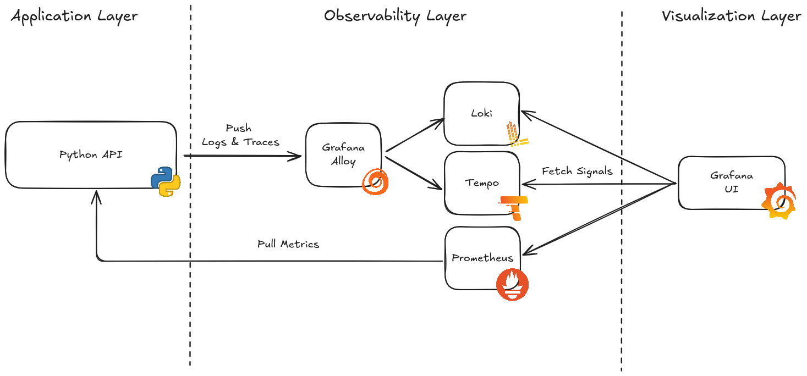

## Overview

In this project I created a very simple Python API to show how one can monitor it using a modern tech stack. I setup instances of Loki (Log Collection), Tempo (Trace Collection) and Prometheus (Metric Collection). Logs and Traces are collected and processed using Grafana Alloy, an Open Telemetry Collector. Prometheus automatically scrapes a `/metrics` endpoint of the API and does not use Alloy. The final monitoring can be observed in the Grafana UI.

The Python API uses FastAPI and is very simple, as this was not the focus of this exercise. I included a call the [Pokemon API](https://pokeapi.co/) in order to showcase tracing with external APIs.

### Architecture

ToDo: Architecture Diagram

As I had only little experience with creating APIs and even less with monitoring them, I tried to choose commonly accepted tools for this.

- API: FastAPI was a natural choice since I worked with it in the past. In addition, its documentation and user base is really large, which helped me with research when I got stuck along the way. Another popular choice here would be Flask.
- Visualization: Similar to FastAPI, I had already worked with Grafana. It seems to be the industry standard, so it was the obvious choice here.
- OTel Collector / Metrics / Logs / Traces: One of my main goals was to get more familiar with Grafana and its stack (-> industry standard), so the choice to stay in the Grafana ecosystem was an easy one. I was quite satisfied with the extensive documentation surrounding those tools, though it was sometimes hard to find non-Grafana-Cloud explanations. Later down the line, I thought about switching to the vanilla OpenTelementry Collector, since researching Grafana Alloy configurations seemed harder than it needs to be.

## Prerequisites

I used the following Docker (Compose) versions to run this project:

- Docker Compose version v2.35.0
- Docker version 28.1.0, build 4d8c241

## How to Run This Project

1. Clone this repository and enter its folder using a terminal
2. Run `docker compose up --build -d` to build the API docker image and start all containers
3. Access the Python API Swagger Docs in a browser using the URL `localhost:8080/docs`
4. Send some test requests to generate metrics and logs. For traces use the `pokemon_name` endpoint
5. Access Grafana UI in a browser using the URL `localhost:3000`
6. Select "Explore" and choose the data source (Loki, Prometheus or Tempo based on which signals you want to explore)
7. Play around in Grafana UI
8. When you're done use `docker compose down` to shutdown the containers

## Lessons Learned

I learned a lot about application monitoring and observability in general. During my research I got more familiar with the three types of signals (metrics, logs and traces) and what questions they answer in a production environment ("Is something happening", "What is happening?", "Where is it happening?"). I feel like I understand the necessity for extensive monitoring now, since without it an application is just a black-box. If it works then all is well, but if it doesn't, it gets frustrating rapidly.

On a technical level I learned the most about OpenTelemetry. Before this project it was just a buzzword to me, but now that I've worked with it, I can explain why it's useful and why it should be implemented in production environments. I found out about receivers, exporters, collectors and other terms. In addition, I could create a mental model for myself how OpenTelemtry, Grafana and signal backends like Loki work together in an observability stack.

I feel I could repeat this project and try to be more independent from the Grafana stack by using Zipkin, Jaeger, FluentD, and others. Due to time constraints and scope, I chose to stay with the Grafana ecosystem for this one.

A big shoutout to GitHub user `autophagy` for providing detailed explanations on how to setup OpenTelemetry in Python: https://github.com/autophagy/pycon-2025-otel-workshop?tab=readme-ov-file#section-3-tracing
